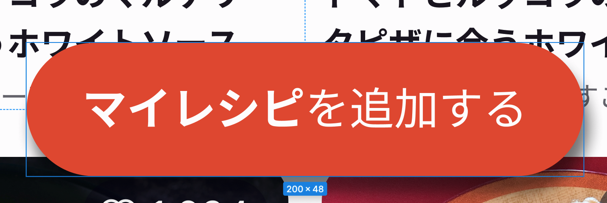

# a要素とbutton要素の使い分け

## はじめに

ページ遷移のみの要素の場合（ページ遷移のみのButton要素）って、
「`a`タグonlyで実装する」or「`button`タグで`a`タグを囲む」
どちらで実装した方が良いのか？（以下のような場合）

## 結論

ページ遷移しか行わないボタン要素を実装する場合、
リンクの機能が主であれば `a`タグ、
ボタンの挙動をカスタマイズしたい場合は `button`タグで使い分ければ良さそう。

また、[HTML Standard](https://html.spec.whatwg.org/multipage/form-elements.html#the-button-element:~:text=%E3%83%95%E3%83%AC%E3%83%BC%E3%82%B8%E3%83%B3%E3%82%B0%E3%83%BB%E3%82%B3%E3%83%B3%E3%83%86%E3%83%B3%E3%83%84%E3%80%82%E3%81%9F%E3%81%A0%E3%81%97%E3%80%81%E3%82%A4%E3%83%B3%E3%82%BF%E3%83%A9%E3%82%AF%E3%83%86%E3%82%A3%E3%83%96%E3%83%BB%E3%82%B3%E3%83%B3%E3%83%86%E3%83%B3%E3%83%84%E3%81%AE%E5%AD%90%E5%AD%AB%E3%81%A8tabindex%E5%B1%9E%E6%80%A7%E3%81%8C%E6%8C%87%E5%AE%9A%E3%81%95%E3%82%8C%E3%81%9F%E5%AD%90%E5%AD%AB%E3%81%AF%E5%AD%98%E5%9C%A8%E3%81%97%E3%81%A6%E3%81%AF%E3%81%AA%E3%82%89%E3%81%AA%E3%81%84%E3%80%82)によると、

> フレージング・コンテンツ。ただし、インタラクティブ・コンテンツの子孫とtabindex属性が指定された子孫は存在してはならない。

という記載があるため、
**button要素の中に、href属性を持つa要素を含むことはそもそもNGである**
