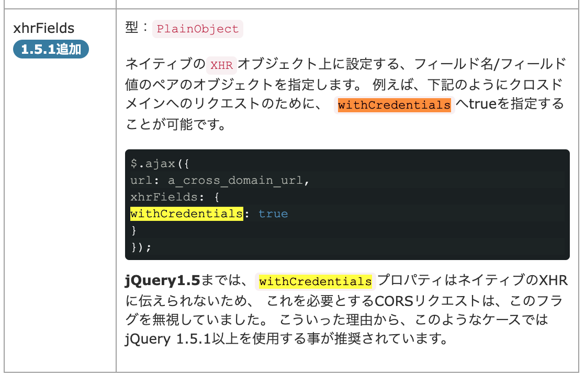

# fetch API

Fetchの使用 | Web API | MDN
<https://developer.mozilla.org/ja/docs/Web/API/Fetch_API/Using_Fetch>

Response | Web API | MDN
<https://developer.mozilla.org/ja/docs/Web/API/Response>

## jQuery.ajax()との仕様の違い

```js
fetch('http://example.com/movies.json', {
    method: 'GET'
  })
  .then(response => {
    if (!response.ok) {
      console.error('サーバーエラー');
    }
    // ここに成功時の処理を記述
  })
  .catch(error => {
    console.error('通信に失敗しました', error);
  });
```

> fetch() から返されるプロミスは、レスポンスが HTTP 404 や 500 を返す HTTP エラーステータスの場合でも拒否されません。サーバーがヘッダーで応答すると、プロミスは直ちに正常に解決します（レスポンスが 200-299 の範囲にない場合は、レスポンスの ok プロパティが false に設定されます）。拒否されるのは、ネットワーク障害があった場合や、何かがリクエストの完了を妨げた場合のみです。

👉 **Fetch APIはネットワークエラーに遭遇したときに`reject`になる。**
（ネットワークエラーにはならずにサーバーエラー（HTTP `5xx` など）の場合は
Promiseは `reject` を返す事はなく、通常通り処理される）

👉 **レスポンスが成功しているかどうか (200–299)は `Response.ok` から拾う事はできる。**

👉 **クライアントエラーレスポンス (400–499) やサーバーエラーレスポンス (500–599) を拾いたい場合は、`response.status` や `response.statusText` などを参照してやる**必要がある。

>credentials オプションを include に設定しない限り、fetch() は次のように動作します。
オリジン間リクエストではクッキーを送信しません。
オリジン間のレスポンスでは、送り返されたクッキーを設定しません。
2018年8月現在、既定の資格情報ポリシーは `same-origin` に変更されています。
Firefoxもバージョン61.0b13で変更されました）。

`jQuery.ajax()`の場合は、以下のように、`xhrFields`フィールドにて設定することができる。



```js
$.ajax({
  url: 'http://example.com/',
  type: 'GET',
  xhrFields: {
    withCredentials: true
  },
  success: function(data) {
    // リクエストが成功した場合の処理
    console.log(data);
  },
  error: function(error) {
    // リクエストが失敗した場合の処理
    console.error(error);
  }
});
```

## 標準で例外として拾うものは？

- `AbortController`によるリクエストの中止
（`abortController.abort`メソッドが実行👉`AbortSignal`の`abort`イベント発火実行👉例外が発生し`catch`ブロックに処理が流れる）
- リクエストの型が不正
- ネットワークレベルのエラー

### とりあえず、ajax的なエラーハンドリングで乗り換えるには？

```js
fetch('http://example.com/movies.json', {
    method: 'GET'
  })
  .then(response => {
    if (!response.ok) {
      console.error('response.ok:', response.ok);
      console.error('esponse.status:', response.status);
      console.error('esponse.statusText:', response.statusText);
      // リクエスト成功時(200-299)以外のレスポンスステータスコードの場合は、
      // Errorを投げる(その時点でcatchに行く)
      throw new Error(response.statusText);
    }
    // 成功時処理
  })
  .catch(error => {
    // ネットワークエラーでも !response.ok でもここで処理できる
    console.error('エラーが発生しました', error);
  });
```

## ブラウザ対応状況

### Authorization header removed from cross-origin redirects

クロスオリジンリダイレクト時に自動的にAuthorizationヘッダーを削除するもの。
👉 Chrome、Edgeが対応していない & そもそもクロスオリジンリダイレクト中にAuthorizationヘッダーを保持するケースがそこまであるのか？(サーバーサイドでリダイレクトを処理or必要なAuthorization情報をURLパラメーターやクッキーなどで渡すetc)

### init.keepalive parameter

fetch()メソッドのオプション。ページの終了後のリクエストを許可するのに使用されるもの。(リクエストとレスポンス間の接続を保持するってこと？)
👉 少なくともウチでは使うことは無さそう。

### init.priority parameter

実験段階の機能だからそもそもプロダクトで使うことはまだ無さそう。
