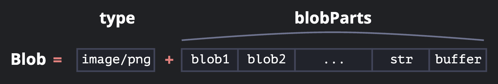

# バイナリデータを理解する

## Blob（File） is 何

### Blob



- Binary Large OBject の略
- 単にバイナリデータの塊を表現したもの
- ウェブブラウザ（WEB API）ではデータを保持する役割を担う Blob クラスが実装されています。
- Blob には WEB API の File が継承されていて、プロパティにはデータサイズや MIME タイプを持つ。。
- Blob のバイナリデータは、File API を介してのみアクセスされることを想定してる。
- バイナリデータを扱うものとして、ArrayBuffer / TypedArrays（型付き配列）などがあるが、主に直接操作できるバイナリデータを扱うのに用いられるのに対し、Blob はイミュータブル（不変）なバイナリデータを扱う。

### File

ファイルについての情報を持っていて、Blob インタフェースを継承。

> (MDN)File オブジェクトは特別な種類の Blob オブジェクトであり、 Blob が利用できる場面ではどこでも利用できます。特に、FileReader、URL.createObjectURL()、createImageBitmap() 、XMLHttpRequest.send() は、Blob と File の両方を受け付けます。File インターフェイスはメソッドを定義せず、Blob インターフェイスからメソッドを継承しています。

```ts
/** Provides information about files and allows JavaScript in a web page to access their content. */
interface File extends Blob {
  readonly lastModified: number;
  readonly name: string;
}
// Blob のプロパティ・メソッドに加え標準・推奨の2プロパティを持っていれば File という判定
```

### base64

バイナリと言ってもそのデータの形式は様々。そのためどのデバイスでも使える事を保証する共通の規格が必要。
👉0 から 64 までの ASCII コードを用いて、バイナリデータを安全で “**読み出し可能な**” 文字列として表現 -> **base64**

> Base64 は、データを 64 種類の印字可能な英数字のみを用いて、それ以外の文字を扱うことの出来ない通信環境にてマルチバイト文字やバイナリデータを扱うためのエンコード方式

### Blob URL（url としての blob）

- url としての blob -> `URL.createObjectURL`メソッドを使用することで、`blob:<origin>/<uuid>` という形式の一意な URL を生成。
- Blob URL はメモリに展開済みのデータへのリファレンスで、JavaScript エンジン上にデータはロードされない。
- Blob URL は参照なので JavaScript でデータ加工したりできない。
- type のおかげで blob をダウンロード/アップロードすることも可能。

```js
let link = document.createElement('a');
link.download = 'hello.txt';
let blob = new Blob(['Hello, world!'], { type: 'text/plain' });

// ex: link.href = blob:https://javascript.info/1e67e00e-860d-40a5-89ae-6ab0cbee6273
link.href = URL.createObjectURL(blob);

// 動的に生成された Blob を利用者にダウンロードさせる
link.click();

// blob のマッピングがある間、blob 自身はメモリ内に存在し続けます（アンロードしない限り、URL を作成すると、それ以上必要なくなっても、blob はメモリに溜まります）
// そのため、revokeObjectURL()メソッドを用いて内部のマッピングから参照を削除しメモリを解放する
// このメソッドを呼び出した時点で blob url を無効になるため、ダウンロードされた後に実行する
URL.revokeObjectURL(link.href);
```

### Data URL

```html

```

- data url -> `data:[<mediatype>][;base64],<data>` の形式
- blob を base64 に変換するためには、組み込みの FileReader オブジェクト の readAsDataURL メソッドを使用。
- ファイルを読み込んで Data URL を作成すると、JavaScript エンジンはファイルサイズに比例した大量のメモリを確保する。

### URL.createObjectURL(blob) vs Blob to data url（FileReader）

URL.createObjectURL(blob) がよりシンプルで速い。

**URL.createObjectURL(blob)**

- メモリを気にする場合は、無効にする必要があります。
- blob への直接アクセス、“encoding/decoding” はありません。

**Blob to data url**

- 何も無効にする必要はありません。
- 巨大な blob のエンコーディングでは、パフォーマンスとメモリを失います。

## [大前提]ブラウザ環境 or Node 環境

<Node 環境>

- Buffer クラスを利用

> Buffer instances are also JavaScript Uint8Array and TypedArray instances. (DeepL)Buffer インスタンスは JavaScript の Uint8Array と TypedArray インスタンスでもある。
> https://nodejs.org/api/buffer.html#buffers-and-typedarrays

<ブラウザ環境>

- JavaScript 自体に実装されている ArraryBuffer オブジェクトを利用
- Buffer は実装されていない

## ArrayBuffer

ArrayBuffer は確保するメモリのバイト長を指定して生成します。メソッドはほとんどないため、この ArrayBuffer を直接操作することはありません。

```ts
new ArrayBuffer(10);
// ArrayBuffer {
// [Uint8Contents]: <00 00 00 00 00 00 00 00 00 00>,
// byteLength: 10
// }
```

## TypedArray

バイナリデータを操作するためには `ArrayBuffer` から `TypedArray` ビューを生成する必要がある。（生のバイナリデータに近い ArraryBuffer をより使いやすい形に変換する必要がある）

その際に最もよく利用されるのが `Uint8Array` 。（Uint8Array は JavaScript 標準で実装されている ArraryBuffer のビュー）

Uint8Array は符号なしの 8 ビット=1 バイト単位でメモリ領域を扱います。メモリは 1 バイト単位で扱われるのが一般的なのでこの Uint8Array がメモリ領域を表現するのに一番自然です。

TypedArray はコンストラクタに ArrayBuffer を入力することで生成できます。

```ts
const buffer = new ArrayBuffer(8);
new Uint8Array(buffer);
// Uint8Array(8) [
//   0, 0, 0, 0,
//   0, 0, 0, 0
// ]
```

## 参考文献

- <https://developer.mozilla.org/ja/docs/Web/API/Blob>
- <https://developer.mozilla.org/ja/docs/Web/API/File>
- [Blob って一体何者？使い方まとめ（JavaScript/TypeScript） - okigaki_log](https://okiyasi.hatenablog.com/entry/2021/01/07/021024)
- [Blob - JavaScript.info](https://ja.javascript.info/blob)
- [ArrayBuffer, binary arrays - JavaScript.info](https://ja.javascript.info/arraybuffer-binary-arrays)
- [https://qiita.com/Yuki_Oshima/items/6346231d93ca342899f0](JavaScript/Node.js でのバイナリデータ処理 #JavaScript - Qiita)
