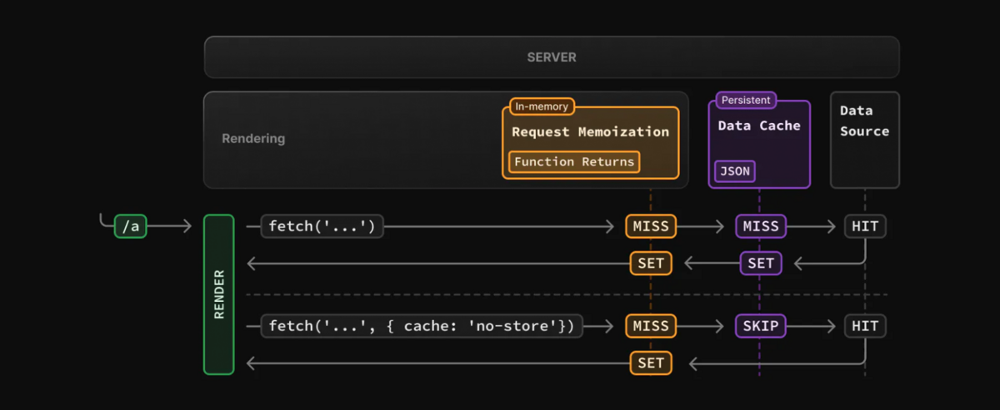
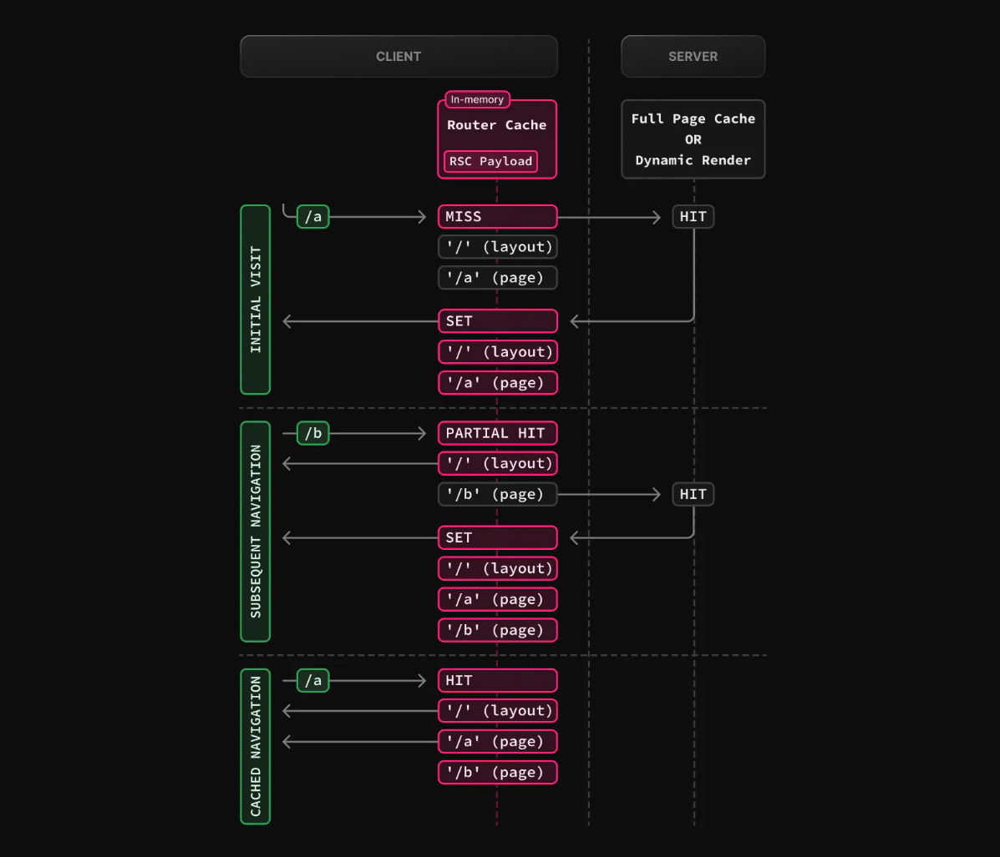

# AppRouter における 4 大 Cache をほんの少し理解する

## 4 大 cache

| Mechanism                          | What                                                             | Where  | Duration                           |
| ---------------------------------- | ---------------------------------------------------------------- | ------ | ---------------------------------- |
| React Cache（Request Memoization） | 重複リクエストを排除し、リクエスト数を減らす                     | Server | リクエスト毎                       |
| Data Cache                         | **Fetch 単位**でデータをキャッシュする                           | Server | 永続的（再検証可能）               |
| Full Route Cache                   | **静的ルート（HTML、RSC ペイロード丸ごと）単位**でキャッシュする | Server | 永続的（再検証可能）               |
| Router Cache                       | `next/link` の `prefetch` した結果をキャッシュする               | Client | ユーザー・セッション or 時間ベース |

## React Cache（Request Memoization）

**1 回のレンダリングの中で同じ URL とオプションを持つリクエスト はキャッシュで再利用する**というもの。
そのため、コード上では同じ API を各所で呼ぶように記述するだけでリクエストの数は一回だけになり、そのレスポンスが使い回されるようになります。

Next.js の fetch 関数 を利用するだけでこれを実現することができる。また、fetch 関数 etc を使えない場合は [React Cache を直接使用する](https://nextjs.org/docs/app/building-your-application/caching#react-cache-function)ことで DB アクセスや GraphQL やらでも実現できる。
また、fetch 関数により生成されたキャッシュは画面描画が終わると破棄される。（レンダリングごとに自動的にキャッシュを破棄する）


## Data Cache

Next.js の fetch 関数等を用いて出されたリクエストのレスポンスに対するキャッシュのことを指す。
つまり、fetch によりデータソースにリクエストした結果は Data Cache に保存され、以降同一リクエストは Data Cache から返される。
👉 オリジンデータソースへのリクエスト数を減らすことにつながる

**明示的に設定しなければこのキャッシュは残り続ける**（バグの温床）ため、一定期間や特定のタイミングでキャッシュを破棄するために、
`fetch` オプション（`Revalidation` や `Opt out` ）などによる再検証やオプトアウトが用意されている。

```tsx
// 1時間でRefalidationが行われるようにオプションを付与
fetch('https://...', { next: { revalidate: 3600 } });

fetch(`https://...`, { next: { tags: ['a', 'b', 'c'] } }); // これによって得られるレスポンスに a, b, c 3つのタグを付与
revalidateTag('a'); // a というタグがついているキャッシュをRevalidate (これで上記のfetch関数で得られたキャッシュが破棄される)

// Opt out（キャッシュを生成させないようにする）
// 注意 : あるRouteがOpt outするよう設定されているfetch関数を含む場合、そのRouteでは Full Route CacheもOpt outされる
fetch(`https://...`, { cache: 'no-store' });

//Route Segment Config オプションを使用
// 特定のルートセグメントのキャッシュを無効にする（サードパーティライブラリを含む、ルートセグメント内のすべてのデータリクエストに影響）
export const dynamic = 'force-dynamic';
```



## Full Route Cache

**ビルドまたは再検証時に静的にレンダリングされたルート（Route）に対して、サーバーサイドで RSC Payload と HTML を生成し、それらを Full Route Cache として保存**する。（動的ルートはリクエスト時にレンダリングされるので、Full Route Cache への保存はスキップされる。）

RSC Payload と HTML を丸ごとキャッシュ 👉 クライアントサイドで静的ルートにアクセスしたときには既に Data Cache やデータソースへのリクエストは完了している。

また Data Cache と同様に永続的で再検証によりキャッシュを破棄することができるが、**Data Cache とは異なり再デプロイによってもキャッシュは破棄される。**

## Router Cache

**App Router の navigation （`next/navigation`）は `prefetch` によりルートを事前に取得し、その結果（訪問済みのルート）をクライアントサイドで静的/動的ルート問わずキャッシュ**している。**この cache が Router Cache（ただの prefetch の cache）**。

これによりフォワード/バックナビゲーションによる高速な画面遷移を実現することができ、ナビゲーションの UX 向上につながる。

キャッシュではあるが、遷移時に必ず通る処理であることを注意する（なければ遷移時に fetch して cache に格納してるよ）

**Router Cache はユーザーセッション中で有効なので、リロードするとキャッシュが破棄される。また、時間経過（30 秒もしくは 5 分間 ）によっても破棄される。**



### 時間経過におけるキャッシュの破棄

Router Cache の 時間経過におけるキャッシュの破棄は、取得時間と利用時間によって複雑に分岐がある。

#### cache の種類

- `auto` - ページが動的な場合は、ページデータを部分的にプリフェッチし、静的な場合はページデータを完全にプリフェッチします。
- `full` - ページデータを完全にプリフェッチする。
- `temporary` - next/link で prefetch={false}が使われているとき or プログラムでルートをプッシュするときに使用されるキャッシュ。

#### cache のステータス

- `fresh`, `reusable` 👉 prefetch/fetch を再発行せず、cache を再利用する
- `stale` 👉 Dynamic Rendering 部分だけ遷移時に再 fetch を行う
- `expired` 👉 prefetch/fetch を再発行する

| 時間判定 / cache の種類           | auto     | full     | temporary |
| :-------------------------------- | :------- | :------- | :-------- |
| prefetch/fetch から **30 秒以内** | fresh    | fresh    | fresh     |
| lastUsed から 30 秒以内           | reusable | reusable | reusable  |
| prefetch/fetch から 30 秒~5 分    | stale    | reusable | expired   |
| prefetch/fetch から 5 分以降      | expired  | expired  | expired   |

この表から、同じアプリケーション内での遷移に関しては、何かしらの工夫を都度行わなければ最低でも 30 秒間キャッシュされた値が表示され続けてしまうことが分かる。

### Router Cache の問題点

- Invalidate (失効させる) ことは出来ても、Opt out (そもそも生成されないようにすること) はできない。 -> `router.refresh()`で全ての cache を無効化することは可能ではある。
- 同じアプリケーション内での遷移に関しては、何かしらの工夫を都度行わなければ最低でも 30 秒間キャッシュされた値が表示され続けてしまう。

## 参考文献

[Next.js: App Router: Building Your Application: Caching in Next.js](https://nextjs.org/docs/app/building-your-application/caching)

[Next.js: App Router: API Reference: Functions: fetch](https://nextjs.org/docs/app/api-reference/functions/fetch)

[Next.js App Router 知られざる Client-side Cache の仕様](https://zenn.dev/akfm/articles/next-app-router-client-cache)

[Next.js の App Router が提供する 4 つのキャッシュ機能 - SO Technologies 開発者ブログ](https://developer.so-tech.co.jp/entry/2023/11/06/121802)
[Next.js の 4 つのキャッシュ](https://zenn.dev/frontendflat/articles/nextjs-cache)
