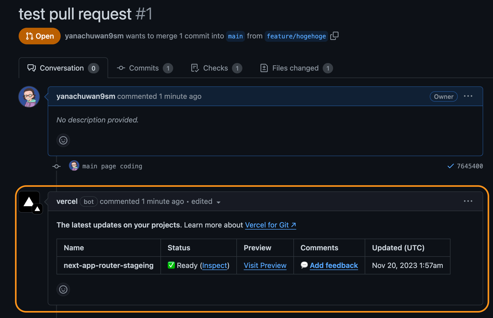

# NextJS（App Router）プロジェクトに vercel ステージング環境を構築する

方法としては 2 通り。

- プロジェクトで設定したドメイン（Vercel が提供する）のサブドメインとなるプレビュー環境（デプロイメント）
- カスタムドメインにおける指定ブランチに対するプレビュー環境

[検証 Repos](https://github.com/yanachuwan9sm/next-app-router-stageing)

## プロジェクトで設定したドメイン（Vercel が提供する）のサブドメインとなるプレビュー環境（デプロイメント）

[Preview Deployments Overview | Vercel Docs](https://vercel.com/docs/deployments/preview-deployments)

**基本的には、接続した Git リポジトリの本番ブランチにプッシュされたコミットには、プロジェクトで設定したドメインが割り当てられる。**

Vercel はデフォルトで、以下の場合に新しいプレビューを自動で作成してくれる。（ドメインはサブドメイン）

① 本番ブランチではない、接続されている Git ブランチ（たとえば main）に変更をコミットする。
② CLI の vercel コマンドを使ってデプロイメントを作成する。

（プレビューデプロイメントを生成したくない場合は、[オフ](https://vercel.com/docs/deployments/preview-deployments#turning-off-preview-deployments)にすることができる）

勿論、Vercel さんが色んな機能が提供されているため設定も楽ちん。
👉 検索エンジンのインデックス化を無効 or デプロイメントの保護（Vercel 認証・Password Protection・Trusted IPs）

[Methods to Protect Deployments | Vercel Docs](https://vercel.com/docs/security/deployment-protection/methods-to-protect-deployments)

## 独自ドメインにおけるプレビュー環境

独自ドメインを別のブランチに自動的に割り当てるには、[ドメインの Git Branch フィールドに入力](https://vercel.com/docs/projects/domains/assign-domain-to-a-git-branch)する。検索エンジンのインデックス化を無効 or デプロイメントの保護 はよしなになってくれないので、Middleware なりで自力で対応する必要がある。

[Next.js v13 の Middleware を使って vercel ステージング環境を構築しよう](https://zenn.dev/otacle/articles/97a32dc02106be)
