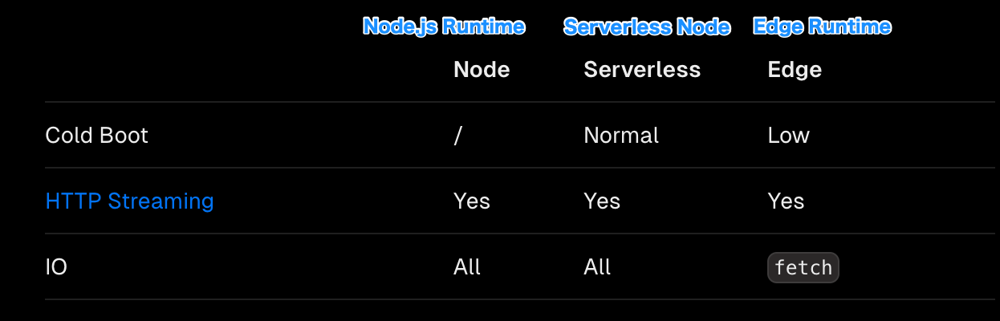

# NextJS 公式に書いてある edge-runtime と node-runtime が分かりづらい。

公式で書いてる説明が分かりづらい。

[Rendering: Edge and Node.js Runtimes | Next.js](https://nextjs.org/docs/app/building-your-application/rendering/edge-and-nodejs-runtimes)

## 結論

Edge Runtime も Serverless Node.js も一括りにすれば、サーバーレス。



## Serverless Node.js

### Pros

- Edge Runtime よりも複雑な計算負荷を処理できるスケーラブルなソリューションが可能。
- Vercel の Serverless Functions では、インポートしたパッケージ、フォント、ファイルを含めて、全体のコードサイズは 50MB まで対応可能。

### Cons

- Serverless Function は**ステートレスで、最大実行時間がある**。（Websocket 通信を維持する事は出来ない。）
- リクエストの処理を開始するまでに数百ミリ秒の起動時間がかかることがある
- トラフィック量(アクセス数)によっては、こちら側で制御できない（Vercel 任せ）ため、サーバーが落ちてしまう可能性がある。

### サポートされている API

- [API Routes](https://nextjs-ja-translation-docs.vercel.app/docs/api-routes/introduction)

- [Route Handlers](https://nextjs.org/docs/app/building-your-application/routing/route-handlers)

- <https://nodejs.org/docs/latest/api/>

Serverless Function における最大実行時間は以下の通り（[公式](https://vercel.com/pricing)）

Hobby : 10 seconds
Pro : 300 seconds
EnterPrice : 900 seconds

[Serverless Functions Overview | Vercel Docs](https://vercel.com/docs/functions/serverless-functions)
[Do Vercel Serverless Functions support WebSocket connections?](https://vercel.com/guides/do-vercel-serverless-functions-support-websocket-connections)

## Edge Runtime

- Serverless Node.js より軽量なランタイムを持つサーバーレス関数である。**俗に言う、CDN エッジサーバー。**

- 特徴としては、コードサイズの上限が小さく、メモリ容量も小さく、すべての Node.js ライブラリをサポートしているわけではない。

- Edge Runtime は、**Edge Functions と Edge Middleware の２つで分けることができる。**
  - Edge ファンクションと Edge ミドルウェアで使用するヘルパー関数のセットを提供する Node.js モジュールとして、`vercel/edge`パッケージがある。[公式リファレンス](https://vercel.com/docs/functions/edge-functions/vercel-edge-package)

### Pros

- リクエスト元のクライアント機械のできるだけ近くのリージョンからコンテンツを取得出来るため、コールドスタートはほぼほぼない。
- CDN のため、レイテンシやスケーラビリティもとても良い。(トラフィックも効率よく捌く)
- ストリーミング処理と組み合わせると UX が良い。[公式](https://vercel.com/blog/gpt-3-app-next-js-vercel-edge-functions#edge-functions-with-streaming)

### Cons

- Vercel 上の Edge Runtime で実行されるコードは 1~4MB で抑える必要があるため、多くの実装で制限を超える場合がある。

### Edge Functions

> OAuth コールバックの実行、ウェブフックリクエストへの応答、短い制限時間内にリクエストが完了しないと失敗する API とのやり取りなど、ネットワーク経由で可能な限り高速にデータをやり取りする必要がある場合に便利です。

config 変数を定義し、ランタイムを"edge "に設定するだけで、API ルートを Edge Function として定義することができる。

```tsx
export const config =  {
 runtime: "edge"、
};
```

[Edge Functions Overview | Vercel Docs](https://vercel.com/docs/functions/edge-functions)

### Edge Middleware

- [ミドルウェア API](https://vercel.com/docs/functions/edge-middleware/middleware-api) は、FetchEvent、Response、Request などの Web 標準 API を拡張した Edge Runtime を使用している。（[Edge Middleware](https://vercel.com/docs/functions/edge-middleware)とも呼ばれる。）
  - Edge Middleware を用いた[公式 example](https://github.com/vercel/examples/tree/main/edge-middleware)もある。

[Edge Middleware Overview | Vercel Docs](https://vercel.com/docs/functions/edge-middleware)

### サポートされている API

- <https://nextjs.org/docs/app/api-reference/edge>
