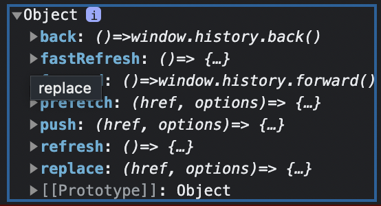

# ⛱️ next/router

## ハードナビゲーションとソフトナビゲーション

### ソフトナビゲーション

ナビゲーションの際、変更されたセグメントのキャッシュは（存在すれば）再利用され、サーバーへの新たなデータ要求は行われない。

ソフト・ナビゲーションの条件
ナビゲーションにおいて、Next.jsは、ナビゲート先のルートがプリフェッチされており、動的セグメントを含まないor現在のルートと同じ動的パラメーターを持つ場合、ソフトナビゲーションを使用します。

### ハードナビゲーション

ナビゲーションの際、キャッシュは無効化され、サーバーはデータをリフェッチし、変更されたセグメントを再レンダリングする。

### 戻る/進むナビゲーション

戻る・進むナビゲーション（`popstate`イベント）にはソフトナビゲーション動作があります。つまり、クライアント側のキャッシュは再利用され、ナビゲーションはほぼ瞬時に行われます。

Docs:
<https://nextjs.org/docs/app/building-your-application/routing/linking-and-navigating#soft-navigation>

## useRouter

<https://nextjs.org/docs/app/api-reference/functions/use-router>

```tsx
import { useRouter } from 'next/navigation';
```

`useRouter()`の返り値は以下の通り。

```tsx
export interface AppRouterInstance {
    /**
     * Navigate to the previous history entry.
     */
    back(): void;
    /**
     * Navigate to the next history entry.
     */
    forward(): void;
    /**
     * Refresh the current page.
     */
    refresh(): void;
    /**
     * Navigate to the provided href.
     * Pushes a new history entry.
     */
    push(href: string, options?: NavigateOptions): void;
    /**
     * Navigate to the provided href.
     * Replaces the current history entry.
     */
    replace(href: string, options?: NavigateOptions): void;
    /**
     * Prefetch the provided href.
     */
    prefetch(href: string, options?: PrefetchOptions): void;
}
```



### router.push()

指定されたルートへのクライアントサイドナビゲーションを実行する。ブラウザの履歴スタックに新しいエントリを追加します。

### router.back()

ソフトナビゲーションを使って、ブラウザの履歴スタックで前のルートに戻る。（ブラウザの履歴を1つ前のページに戻す機能を提供）

内部としてはHistoryAPIである`window.history.back()`メソッドが動いている。そのため、**遷移するページがない場合（同ドメイン内で戻れるページが存在しない場合）、このメソッドを実行しても何も起こらない**


一般的には、フォームなどを入力する画面で、ユーザーが誤って閉じる・戻るなどの誤操作をしてしまった際にページ遷移を防ぐ目的で使用。

> このイベントによって、ウェブページがダイアログボックスを表示し、ユーザーにページを終了するかどうかの確認が求めることができます。ユーザーが確認すれば、ブラウザーは新しいページへ遷移し、そうでなければ遷移をキャンセルします。
引用 : <https://developer.mozilla.org/ja/docs/Web/API/Window/beforeunload_event>

**History APIを使ったページ遷移（同ドメイン・同スキーム）と、URL hashのみが変化するようなページ遷移（formでのsubmitは離脱として扱われる）-> `beforeunload`イベントが発生しません。**