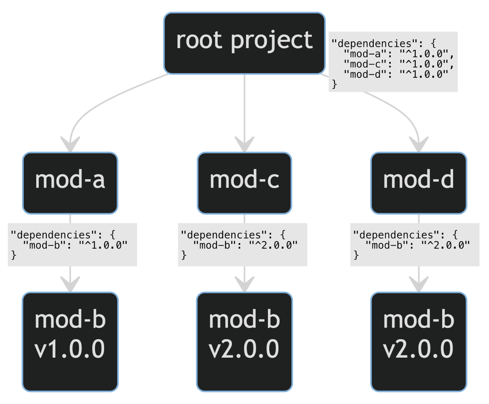

# ざっくり npm-yarn

## npm

- 多分最もメジャーな歴史の長いパッケージマネージャー。
- 2020 年に Github が買収し、現在は MS 管理下にある
- 「npm is not an acronym」を再帰的に表したもの（Node Package Manager の頭文字ではない）

### npm v3 以前 -> ネストされる node_modules

```json
node_modules/
|-- mod-a
|   `-- node_modules
|       `-- mod-b
`-- mod-c
    `-- node_modules
        `-- mod-b
```

node_modules 直下のディレクトリには、プロジェクトに直接依存しているパッケージのみが配置されるもの。

<問題点>

```json
node_modules/
|-- mod-a(v1.0.0)
|   `-- node_modules/
|       `-- mod-b(v1.0.0)
|-- mod-c(v1.0.0)
|   `-- node_modules/
|       `-- mod-a(v1.0.0)
|           `-- node_modules/
|               `-- mod-b(v1.0.0)
|-- mod-d(v1.0.0)
|   `-- node_modules/
|       `-- mod-b(v2.0.0)
```

- 依存関係が深くなると、そのままディレクトリ構造が深くなっていくこと
- 同じパッケージが複数回現れること（重複のインストールが発生する）

### npm v3（2015-06-25） -> フラット化される node_modules



```json
// mod-bのv2.0.0は依存関係の中で重複しているので、親ディレクトリに配置
// mod-bのv1.0.0はそのままmod-a以下のnode_modulesに配置（メジャーバージョンが異なるため、dedupeがされなかった）
node_modules/
|-- mod-a
|   `-- node_modules
|       `-- mod-b
|-- mod-b
|-- mod-c
`-- mod-d
```

- **重複削除**（deduplication, 略して dedupe）を導入。
- 依存関係内の重複パッケージは**hoisting**（巻き上げ）によって flat に配置される（node_modules の階層が浅くなるように保つ）

**💎 フラット化したことによる課題点 3 つ**

- 直接インストールしていないパッケージの依存モジュールを require できてしまう（**hoisting によって、dependencies に書かれていないモジュールが node_modules 以下に現れる**。👉 dependencies に書かれていないモジュールも require することができる）
- dedupe する分 npm install のパフォーマンスの低下
- npm install をする順番で、node_modules 以下のディレクトリ構造が変わる（node_modules インストールの不確定性）

### npm v5（2017-05-26）

ロックファイル(package-lock.json)を導入 -> package-lock.json は木構造を含むので、npm のバージョンに依存することなく、node_modules の木構造を再現することができます。

### npm v7（2020-10-13）

- **npm install の順番によらず、決定論的に node_modules の木構造が決まるよう**になりました。
- package-lock.json が v2 となり、パフォーマンスの改善が施される。
- yarn v1 にもあるような、workspace 機能が追加

（npm も yarn v1 と同等の機能を持つことになる。）

### npm v9.4.0 （2023-01-25）

- npm に`--install-strategy=linked`オプションが追加され、シンボリックリンク方式が npm でも利用可能になる(2023-06-23 現在では experimental 機能)

## yarn

### yarn v1（classic）2020 年 ~ メンテナンスモード対象

<https://classic.yarnpkg.com/en/docs/install#mac-stable>

- 2016 年に当時の Facebook と Google を中心に開発。
- npm v5 の hoisting、dedupe による問題（木構造が不変ではない）を受け、以下の特徴を持つ。

① 依存関係の木構造が普遍(後述)
② ロックファイル(yarn.lock)導入によるバージョン固定
③ 依存解決(node_modules 配下の構造)の非決定性の対策

<問題点>

```json
# yarn lockfile v1

mod-a@^1.0.0:
  version "1.0.0"
  resolved "https://registry.yarnpkg.com/mod-a/-/mod-a-1.0.0.tgz#d27217e16777d7c0c14b2d49e365119de3bf4da0"
  integrity sha512-LHSY3BAvHk8CV3O2J2zraDq10+VI1QT1yCTildRW12JSWwFvsnzwLhdOdrJG2gaHHIya7N4GndK+ZFh1bTBjFw==
  dependencies:
    mod-b "^1.0.0"

  ・・・

  version "1.0.0"
  resolved "https://registry.yarnpkg.com/mod-c/-/mod-c-1.0.0.tgz#849adb050fcb7f5dd463b105dbf23771a3bd9df0"
  integrity sha512-aUhu8lL4T+UYGNi9qd+DqBfCuDaZxkBJ0gDC5lS9WhQmLusTncROjXL0W8JvVe3mvwrbJCTTbyJ8SJpm1pd9Og==
  dependencies:
    mod-b "^2.0.0"
```

yarn.lock はパッケージの詳細が記載されているのみで、node_modules 以下の木構造の情報は含まない。そのため、**node_modules 以下の木構造は yarn のアルゴリズム、すなはち yarn のバージョンや設定によって変わってしまう**。（yarn のバージョン管理が必要） -> npm v5.X では package-lock.json を使いこの問題を解消。

### yarn v2(Berry)

- 2020 年リリース
- **Plug’n’Play** （PnP）という機能が追加
  - **node_modules を作らないというアプローチを採用**
  - 代わりにモジュールパスのマッピング用の `pnp.cjs` を作成することでパフォーマンスの向上、ディスク容量の効率化になる
  - `pnp.cjs` 👉 Module.\_load をオーバーライドしている。全てのモジュールへのパスが含まれており、require 時に node_modules を探索する必要がない。→ 既存の機能をオーバーライドしているので、対応していないパッケージもある。
  - 各パッケージを zip 化しプロジェクトの .yarn/cache/ 配下に配置、git push することで各々の install 作業が不要になる
- PnP と従来の node_modules を生成するモードが切り替えれる

## 参考文献

<https://pnpm.io/motivation#saving-disk-space>

[npm/yarn の不足点と pnpm を推す理由](https://xingyahao.com/j/pnpm-npm-yarn.html)

[node_modules の問題点とその歴史 npm, yarn と pnpm](https://zenn.dev/saggggo/articles/dbd739508ac212)

[pnpm の特徴](https://zenn.dev/azukiazusa/articles/pnpm-feature)

[yarn の hoisting を理解する](https://tars0x9752.com/posts/yarn-hoisting#%E3%81%AA%E3%81%9Choisting%E3%81%99%E3%82%8B%E3%81%AE%E3%81%8B)
