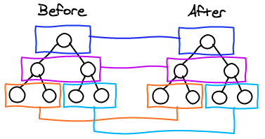
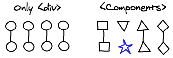

# 仮想 DOM とは？

> 仮想 DOM (virtual DOM; VDOM) は、インメモリに保持された想像上のまたは「仮想の」UI 表現が、ReactDOM のようなライブラリによって「実際の」DOM と同期されるというプログラミング上の概念です。このプロセスは差分検出処理 (reconciliation)と呼ばれます。

> React の世界において “仮想 DOM” という用語は通常、ユーザインタフェースを表現するオブジェクトである React 要素 と結びつけて考えられます。React は一方で、コンポーネントツリーに関する追加情報を保持するため “ファイバー (fiber)” と呼ばれる内部オブジェクトも使用します。これらも React における “仮想 DOM” 実装の一部と見なすことができます。

## 簡単にいうと

- `

` 👉 HTML
- `document.createElement('div')` 👉 DOM API
- `React.createElement("div")` 👉 仮想 DOM 構造体
- `ReactDOM.render(<App />, el)` 👉 仮想 DOM アルゴリズムの実行

## 仮想 DOM 構造体

**DOM (Document Object Model, HTML の API 抽象)** の写像を表現するための軽量なオブジェクト

## 仮想 DOM アルゴリズム（差分検出処理）

React が、あるツリーを別のツリーと差分して、どの部分を変更する必要があるかを判断するために使用するアルゴリズム。

2 つの二分木の最小修正数を求めるアルゴリズム問題については、いくつかの一般的な解決方法が存在しているが、最新のアルゴリズムにおいてツリーの要素数を n として O(n3) ほどの計算量がある。このままだと計算コストが高いため扱いづらかった。

React は 2 つの仮定に基づくことで、計算量 O(n) で非常に優れた近似値を実現している。

1. レベルごとにツリーを調整しており、異なるコンポーネント・タイプは、実質的に異なるツリーを生成すると想定される。（React はそれらを差分しようとはせず、古いツリーを完全に置き換える）（コンポーネントがツリーの別のレベルに移動することは非常にまれなので、これは複雑さを大幅に軽減し、大きな損失にはならない）
   
   
2. 開発者は 一意な key プロパティを用いて、リストの差分を行う。
   

仮想 DOM アルゴリズムの仕組みは以下の記事（React に仮想 DOM の概念を提案、実装した vjeux 氏の記事）がわかりやすい。

[Web Performance Calendar » React’s diff algorithm](https://calendar.perfplanet.com/2013/diff/)

## Fiber

Fiber は React 16 の新しい差分検出処理エンジンです。その主な目的は仮想 DOM の逐次レンダーを可能にすること。

<https://github.com/acdlite/react-fiber-architecture?tab=readme-ov-file>

## Svelte 型コンパイラ

Svelte は仮想 DOM というよりコンパイラ。
宣言的 UI という点は同様だが、ほぼ生の JavaScript にコンパイルされる。

React と Svelte に関する比較記事は以下を参考。
<https://blog.bitsrc.io/react-vs-sveltejs-the-war-between-virtual-and-real-dom-59cbebbab9e9>

React 👉 仮想 DOM による差分検知とそれを DOM に反映させるステップがランタイムで行われる
Svelte 👉 コンパイル時に変換された JS によって直接 DOM を書き換えるようになっている。

当然、ランタイムで差分検知する必要がある以上オーバーヘッドになるコードが存在することになり、これが仮想 DOM によるステップがオーバーヘッドであるという思想。

### コンパイル時に差分検出する

<https://lihautan.com/compile-svelte-in-your-head-part-1/>
<https://www.sunapro.com/svelte/>

## 参考

[仮想 DOM と内部処理 – React](https://ja.legacy.reactjs.org/docs/faq-internals.html)

[差分検出処理 – React](https://ja.legacy.reactjs.org/docs/reconciliation.html)

[2020 年版: なぜ仮想 DOM / 宣言的 UI という概念が、あのときの俺達の魂を震えさせたのか](https://zenn.dev/mizchi/books/0c55c230f5cc754c38b9)
