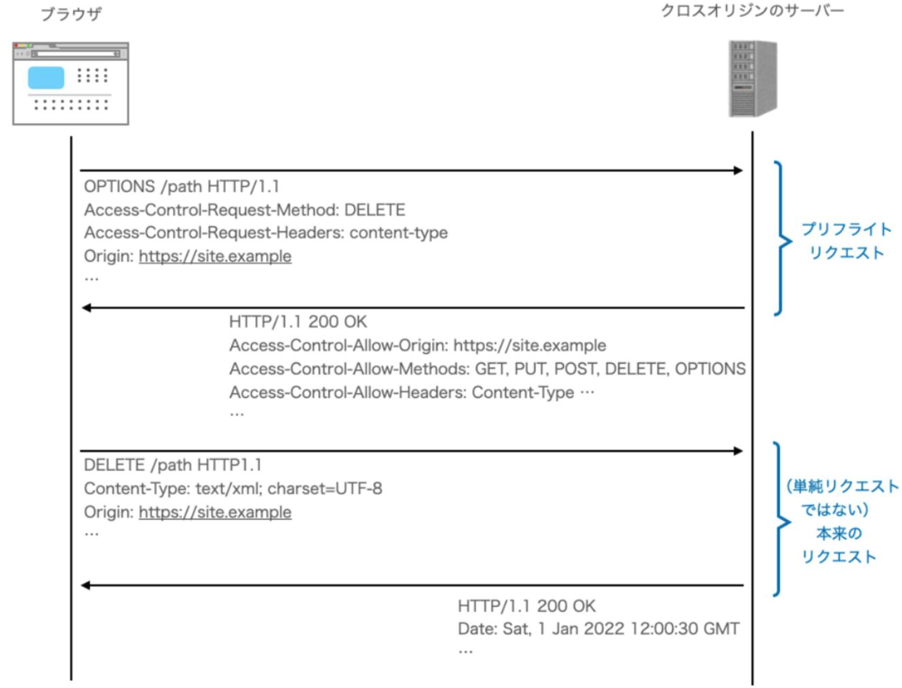

# 🌐 SOP と CORS

## Origin とは？

- ブラウザ内には外部アクセスを制限する Origin という境界がある。
- **Origin** 👉 スキーム + ホスト名 + ポート番号


- 2 つの URL の Origin が同一であるもの → **同一オリジン(Same Origin)**
- 2 つの URL の Origin が異なるもの → **クロスオリジン(Cross Origin)**

## Same Origin Policy (同一オリジンポリシー SOP)とは？

**異なるオリジン（クロスオリジン）からのリソースへのアクセスを制限するという仕組み**。
悪意のあるドキュメントを隔離し、起こりうる攻撃を減らすことが目的。

### 👌 SOP にて制限対象となるもの

- JS(fetch・XHR(XMLHttpRequest))を用いたクロスオリジンへのリクエスト。
  > 厳密には「リクエストはできるがレスポンスを取得できない」という制限で、クロスオリジンでは許可された場合にしかレスポンスを取得することはできない。
- JS を使った iframe 内のクロスオリジンのページへのアクセス。
- クロスオリジンの画像を読み込んだ`canvas`要素へのアクセス (`[drawImage()` (en-US) etc)
- Web Storage・IndexDB に保存されたクロスオリジンのデータアクセス

### ⚡ SOP にて制限対象とならないもの

- `<scrip>`で読み込まれた JavaScript
- `<link>`で読み込まれた CSS
- `@font-face`で読み込まれた Web フォント ＊クロスオリジンでは許可されないブラウザあり
- ``で読み込まれた画像（PNG、JPEG、GIF、BMP、SVG がサポート対象）
- `<video>`、`<audio>`  タグで読み込まれたメディアファイル
- `<object>`、`<embed>`  タグで埋め込まれたリソース
- `<iframe>`、`<frame>`での別サイトコンテンツの読み込み注）コンテンツの読み込みは許可されますが、コンテンツ内のドキュメントにはアクセスできません。

## Cross Origin Resource Sharing (CORS)とは？

**異なるオリジンへのアクセスを許可するには、CORS を利用する。**

CORS とは **追加の  [HTTP](https://developer.mozilla.org/ja/docs/Glossary/HTTP)ヘッダーを使用して**、
ある[オリジン](https://developer.mozilla.org/ja/docs/Glossary/Origin)で動作しているウェブアプリケーションに、
**異なるオリジンにある選択されたリソースへのアクセス権を与えるようブラウザーに指示するための仕組み。**

[オリジン間リソース共有 (CORS) - HTTP | MDN](https://developer.mozilla.org/ja/docs/Web/HTTP/CORS)

- クロスオリジンのサーバーへのリクエスト自体は送信されて、レスポンスも返却される
- レスポンスの CORS ヘッダによってサーバが許可したリクエストと判別したら、ブラウザはエスポンスのデータの取り出しを許可する
- サーバが許可した `Origin` かどうか判別するために、`Access-Controll-Allow-Origin`というレスポンスヘッダを利用する

### やること

- リクエストヘッダ: `Origin` 、`Access-Controll-Request-Origin` の HTTP ヘッダを追加
- レスポンスヘッダ: `Access-Controll-Allow-Origin` の HTTP ヘッダを追加

### **単純リクエスト**

→ 無条件でリクエストを送信して、レスポンスヘッダにより JS がリソースを受け取れるか否かを判断する


### プリフライトリクエスト

**単純ではないリクエスト(データの更新・削除など副作用が生じるリクエスト)**

→ プリフライトリクエストによりリクエスト送信の許可を得る

### ⭐︎ プリフライトリクエストが満たす条件 (逆は単純リクエストが満たす条件)

1. GET、HEAD、POST 以外の HTTP メソッドが利用されるとき
2. `Accept` 、`Accept-Langage` 、`Content-Langage`　、`Content-Type`　以外の HTTP ヘッダが送信される場合
3. application/x-www-form-urlencoded、multipart/form-data、text/plain 　以外の Content-Type ヘッダである場合

### ⭐︎ プリフライトリクエストの流れ



1. `DELETEリクエスト`で HTTP リクエストを送信

2. 単純リクエストではないため、プリフライトリクエストが送られる

> プリフライトリクエストは、以下の HTTP ヘッダを追加して HTTP リクエストを飛ばす。(このとき、実際の内容はまだ送られていない。)

```powershell
OPTIONS /path HTTP1.1
Access-Control-Request-Method: DELETE
Access-Control-Request-Headers: content-type
Origin: http://site.example
```

1. プリフライトリクエストが送られてきたサーバは、以下のように許可する HTTP メソッド・オリジンの情報を返却する。

```tsx
Access-Control-Allow-Method: GET,PUT,POST,DELETE,OPTIONS
Access-Control-Allow-Origin: http://site.example
```

1. プリフライトリクエストで許可が得られたため、DELETE リクエストが送信される

1. あとは単純リクエストの手順と同じ

### 資格情報を含むリクエストの場合

**✅ 資格情報 → Cookie・認証ヘッダー・TLS クライアント証明書**

**`Access-Control-Allow-Credentials`**レスポンスヘッダー

→ リクエストの資格情報モード (`[Request.credentials](https://developer.mozilla.org/ja/docs/Web/API/Request/credentials)`) が  `include`である場合に、レスポンスをフロントエンドの JavaScript コードに公開するかどうかをブラウザーに指示する

[Access-Control-Allow-Credentials - HTTP | MDN](https://developer.mozilla.org/ja/docs/Web/HTTP/Headers/Access-Control-Allow-Credentials)

リクエストで fetch を使う場合、`credentials`オプションを設定することができる

(→ fetch がリクエストと一緒に Cookie（資格情報）を送るべきかを指定するもの)

- `same-origin` :(デフォルト)クロスオリジンリクエストの場合は Cookie を送信しない。同一オリジンの場合のみ Cookie などの資格情報を送信することができる。
- `include` : 資格情報を含むリクエストを、クロスオリジンの場合でも送信することができる。**include**  を設定した場合、レスポンスを返すサーバから  `Access-Control-Allow-Credentials`  を要求する。
- `omit` : 同一オリジンのリクエストの場合でも資格情報を送信しない。

サーバ側は、資格情報付きのリクエストに返答する場合には、以下の条件を満たす必要がある

- `Access-Control-Allow-Credentials`を`true`として返すように設定する
- `Access-Control-Allow-Origin`  で  `"*"` （ワイルドカード）を指定してはいけない。明示的にオリジンを指定する必要がある。
- `Access-Control-Allow-Headers`  で  `"*"` （ワイルドカード）を指定してはいけない。明示的にヘッダー名を指定する必要がある。
- `Access-Control-Allow-Methods`  で  `"*"` （ワイルドカード）を指定してはいけない。明示的にメソッド名を指定する必要がある。
