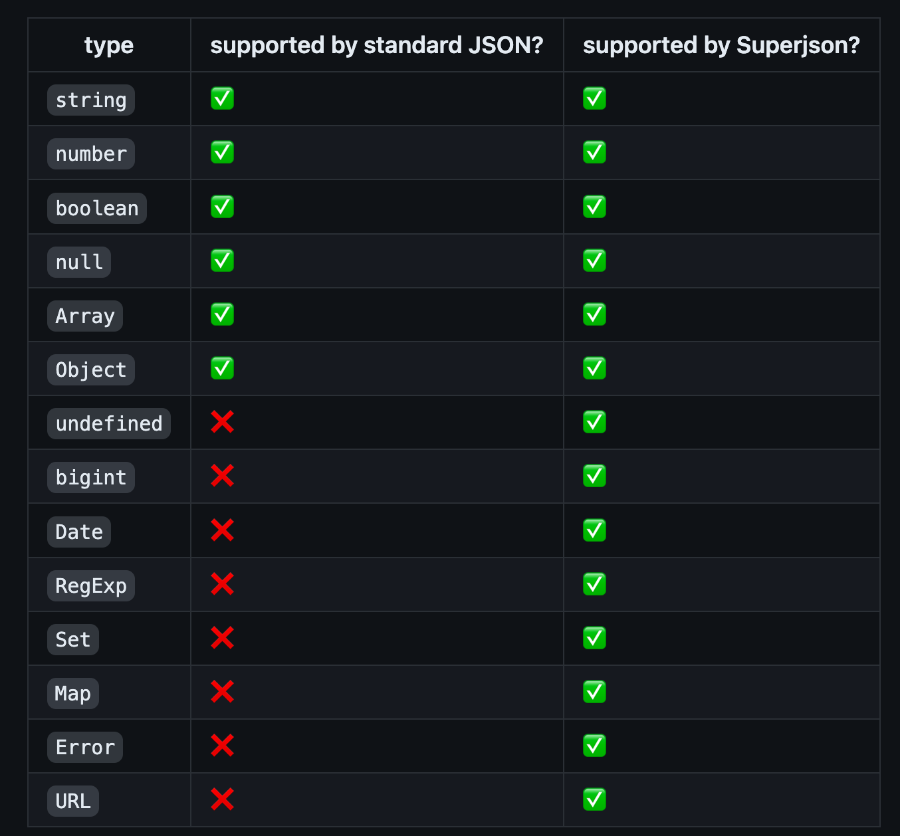

# tRPC の API では バイナリデータ（Buffer） は受け取れない

## tRPC にて受け取れるデータの値

tRPC における Data Transformer という機能 の変換処理を担っているのは`superjson`というライブラリ。
この機能のお陰で、Date/Map/Sets などを送信前にシリアライズしてから、受け取り時にデシリアライズしていることを開発者が意識する必要がない。（HTTP で JSON を送るのにクライアント側で JSON.stringify したり、サーバ側で JSON.parse したりしなくていい）

```ts
// case : APIのパラメータにDate型のデータを設定

// client
const date = new Date(2023, 5, 6);
const { data, isSuccess } = api.example.getAll.useQuery({ date });

// server
  getAll: publicProcedure
    .input(
      z.object({
        date: z.date(),
      })
    )
    .query(({ ctx, input }) => {
      return ctx.prisma.example.findMany({
        where: {
          createdAt: {
            gt: input.date,
          },
        },
      });
    }),
```

その他として、Date/Map/Set 以外にも undefined や正規表現、エラーなども対応している。詳しくは [README](https://github.com/blitz-js/superjson/blob/main/README.md#:~:text=Superjson%20supports%20many%20extra%20types%20which%20JSON%20does%20not.%20You%20can%20serialize%20all%20these%3A) を参照。



## 自分が出会った事象

React(Next.js) + Prisma + tRPC の構成で、アップロードした画像を DB に保存する際に、server 側（prisma）で[File オブジェクトを base64 文字列に変換する処理](https://time-is-life.fun/react-typescript-blob-file-to-base64-using-filereader-readasdataurl/)をやりたい。

ただし、`superjson` は Buffer に対応してないため（参考: [issue](https://github.com/blitz-js/superjson/issues/181)）、フロント側（Next.js）でしゃーなし書いてる。

ちなみに、上記の issue から[対応している型付き配列](https://github.com/blitz-js/superjson/pull/155/files#diff-df7446068188621a3fa66e02d4e5c9081902f1bb2cd9092e06c59271978257d3R200)は以下の通り。

```ts
const constructorToName = [
  Int8Array,
  Uint8Array,
  Int16Array,
  Uint16Array,
  Int32Array,
  Uint32Array,
  Float32Array,
  Float64Array,
  Uint8ClampedArray,
].reduce<Record<string, TypedArrayConstructor>>((obj, ctor) => {
  obj[ctor.name] = ctor;
  return obj;
}, {});
```

### Buffer に対応してないのは何故？？？

ブラウザ環境では、Buffer を扱う際は JavaScript 自体に実装されている ArraryBuffer オブジェクトを利用しており、Buffer クラスは実装されていないから。

## 代替案（Buffer を自動でシリアライズ / デシリアライズ に対応させたい）

### ①Buffer から Uint8array を作成して Buffer としてキャストする

```ts
new Uint8Array(file.blob) as Buffer；
```

### ②superjson の registerCustom を利用する

```ts
superjson.registerCustom<Buffer, number[]>(
  {
    isApplicable: (v): v is Buffer => v instanceof Buffer,
    serialize: (v) => [...v],
    deserialize: (v) => Buffer.from(v),
  },
  'buffer'
);
```
