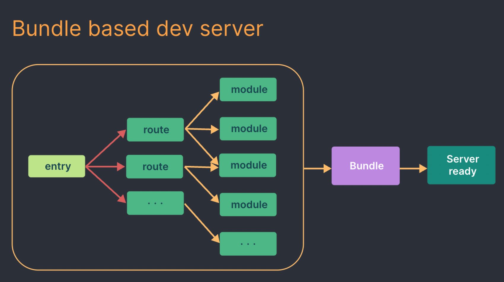
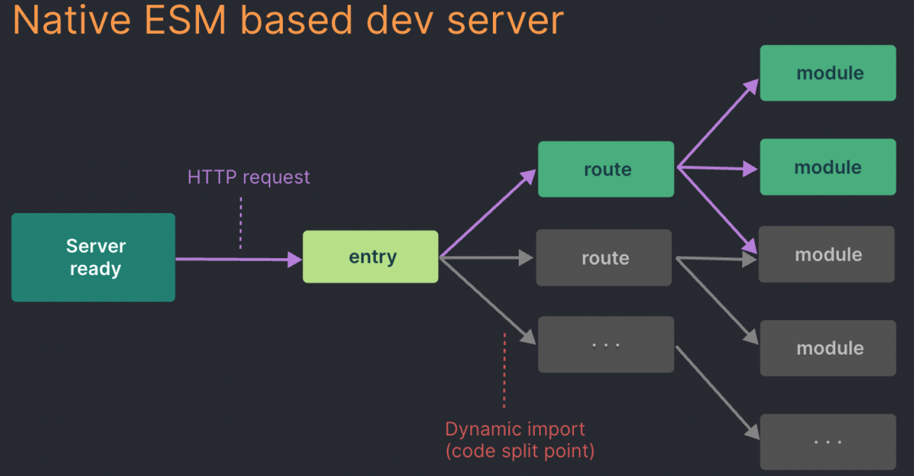

# vite is 何？

## モジュールバンドラの誕生

ES Module は元々ブラウザでは対応していなかった。
（開発者はモジュール化された JavaScript を生成する、ネイティブの仕組みを持っていなかった。）

そのため、モジュールをブラウザ上で実行可能なものにするために、
モジュールの依存関係を解決する機能を持つ、モジュールバンドラが生まれた。

その中でもトップレベルのシェア率を誇り、長い間モジュールバンドラのスタンダードだったものが Webpack である。
js ファイルや css ファイルなどを適切な順番で結合 & 最適化ができる他、
モジュールバンドラでありながら、タスクランナー同様で色んな所に手が届く（オープンエンドであり柔軟性がある）ことが特徴。

## webpack の苦しみ



プロジェクト内の全てのファイルの依存関係を解消した後、バンドルしたソースコードを生成している。
👉 勿論、プロジェクトが肥大化するほど処理する時間も比例して長くなる。

柔軟性が高くオープンエンドであるが故に、以下の２つの問題点も出てきた。
① モジュールのバンドリング以外の役割が増えた。（CSS のプリプロセッサーや TypeScript のトランスパイル etc）
② 外部ツールやローダーを含む独自の複雑な JavaScript パイプラインを組み合わせる事になる。（設定ファイルが複雑化 & 依存関係を解決しづらくなる）
なる

## webpack に続く次世代バンドルツール

- ⭐︎Vite
- ⭐︎esbuild
- ⭐︎Turbopack
- Snowpack
- @web/dev-server
- WMR

### Turbopack

Webpack を置き換えるというモチベーションを元、Next.js 13 に付随している試験的なもの。（👉 Vite の方が様々な JavaScript のフレームワークに対応しており、汎用性が高い。）
Native ESM を軸としておらず、Webpack のようなモジュールバンドラを採用。
主な特徴として、Rust を用いたインクリメンタルな計算を行い、リクエストレベルのコンパイルや遅延読み込み(lazy bundling) 、関数レベルでメモリキャッシュを行っている。

公式は、「Vite よりも処理速度が 10 倍高速」と謳っているが、[Evan You 氏の実験](https://github.com/yyx990803/vite-vs-next-turbo-hmr) や [GMO の実験記事](https://recruit.gmo.jp/engineer/jisedai/blog/turbopack-vs-vite-continued/) によると、純粋な Vite, Turbopack の性能と異なる要因が混在している可能性が考えられるが、性能差にほぼ優位な差がないという結果も出ている。

### Snowpack

このプロジェクトはもう保守されていない。
Snowpack チームは現在、Vite を利用した静的サイトビルダーである Astro に取り組んでいる。

### WMR

Preact チームが開発しているもの。（Vite と同様の機能セットを提供している）
主に Preact プロジェクト向けに設計されており、プリレンダリングなど、より統合された機能を提供している。
そのため、Preact を採用する場合は、自由度の高いエクスペリエンスを提供できる。（👉 Vite の方が様々な JavaScript のフレームワークに対応しており、汎用性が高い。）
また、Vite 2.0 のロールアップのプラグイン・インターフェイスのサポートは WMR に触発されたもの。

<https://vitejs.dev/guide/comparisons.html>

## Vite is 何？

Vue.js の開発者である Evan You 氏が開発する新しい JavaScript ビルドツール。直近だと、State of JavaScript 2022 において、
最優秀採用技術賞、最優秀満足度賞、最優秀関心度賞の 3 つにノミネートされてる。

<主な特徴>

- Native ES Modules（以下、Native ESM）を用いた no-bundle なビルドによる、高速な開発サーバーの起動・モジュール更新の反映

- プラグインによって足りない機能を柔軟にオプトインできる

- 本番ビルド時の最適化

## Native ES Modules（以下、Native ESM）を用いた no-bundle なビルドによる、高速な開発サーバーの起動・モジュール更新の反映

Vite ではアプリケーションのモジュールを依存関係(node_modules)とソースコード（例: JSX、CSS や Vue/Svelte コンポーネント）の
２つのカテゴリーに分けてバンドル処理を行う。



**依存関係** 👉 **esbuild**（Go で書かれた JavaScript バンドラー） を使って（ブラウザから読み込み可能にするために）事前バンドルを行い、ESM に変換する。
**ソースコード** 👉 **モジュールバンドルをせずに、Native ESM を活用。**動的インポートのコード（コード分割）は、アクセスしているブラウザの画面で使われる場合のみ処理される。

ただし、アプリケーションがスケールしてモジュール数が増大した場合は
（モジュールバンドルしていないが故）Native ESM はモジュールの数だけネットワークリクエストが発生するため、
モジュール数が増えるほどに、リクエストの洪水が起こり、初回読み込みに時間がかかる。

HMR も同様に Native ES Modules 上で実行される。
ファイルが編集されたとき、Vite は編集されたモジュールとその最も近い HMR 境界（ほとんどの場合モジュール自身だけ）を対象にする必要があるだけで、アプリケーションのサイズに関係なく HMR の更新を一貫して高速に行うことができる。

## プラグインによって足りない機能を柔軟にオプトインできる

Vite では v2 より**Plugin API（Rollup ベースのプラグインシステム）**を採用している。（元々は WMR が採用していたものを取り入れた） <https://github.com/vitejs/awesome-vite#plugins>
それにより、**Vite のコア部分は最小限の API インターフェースで無駄のない状態を維持しつつ、開発とビルドの両方で動作するプラグインを追加・作成することができる。**

### 開発とビルドの両方で動作するプラグインを追加・作成することができる -> どゆこと？？？

```ts
// https://github.com/vitejs/vite/blob/main/packages/vite/src/node/plugin.ts#L40
export interface Plugin<A = any> extends RollupPlugin<A> {
enforce?: 'pre' | 'post'
apply?:
| 'serve'
| 'build'
| ((this: void, config: UserConfig, env: ConfigEnv) => boolean)
config?: ObjectHook<
(
this: void,
・・・
) => Promise<TransformResult> | TransformResult
>
}
```

```ts
// https://github.com/vitejs/vite/blob/main/packages/vite/src/node/config.ts#L138
import type { HookHandler, Plugin } from './plugin';

export type PluginOption =
  | Plugin
  | false
  | null
  | undefined
  | PluginOption[]
  | Promise<Plugin | false | null | undefined | PluginOption[]>;

export interface UserConfig {
  root?: string;
  base?: string;
  publicDir?: string | false;
  cacheDir?: string;
  mode?: string;
  define?: Record<string, any>;
  plugins?: PluginOption[];
}
```

```ts
// vite.config.js
import vitePlugin from 'vite-plugin-feature';
import rollupPlugin from 'rollup-plugin-feature';

export default defineConfig({
  plugins: [vitePlugin(), rollupPlugin()],
});
```

Rollup の優れた設計のプラグインインターフェースを Vite 特有のオプションで拡張しているから。

そのため、有効な vite プラグイン は 有効な Rollup プラグインである。（逆に、Rollup プラグインは有効な vite プラグインである必要はない。）
それは Rollup プラグインの中には、Native ESM が実質的にバンドルを担っている開発サーバーというコンテキストでは意味をなさないものがあるから。

### Rollup のプラグインインターフェースの何が良いの？

<webpack の場合>

```js
  module: {
    rules: [
      {
        test: /\.js$/,
        exclude: /node_modules/,
        // loaders には webpack-というプレフィックスがついておらず、
        // node_modules から import を書かずに使うことができちゃう
        use: ['babel-loader', 'eslint-loader'],
      },
      {
        test: /\.css$/,
        use: ['style-loader', 'css-loader'],
      },
      {
        // `test`オプション（loader を適用すべきファイルの正規表現）に正規表現を使用して適用されているが、
        // 異なる複数のファイル形式を処理するためにルールを追加すると、可読性が悪い。(エントリポイントや出力先の設定なども同様）
        test: /\.(png|jpe?g|gif)$/i,
        use: 'file-loader',
      },
    ],
  }
};
```

<rollup の場合>

シンプル！でも HMR 非対応というデメリットはある。

```js
import terser from '@rollup/plugin-terser';
import babel from '@rollup/plugin-babel';
import { nodeResolve } from '@rollup/plugin-node-resolve';
import commonjs from '@rollup/plugin-commonjs';
import replace from '@rollup/plugin-replace';
import image from '@rollup/plugin-image';
import postcss from 'rollup-plugin-postcss';

export default {
  input: 'src/main.js',
  output: [
    {
      file: 'bundle.js',
      format: 'cjs',
    },
    {
      file: 'bundle.min.js',
      format: 'iife',
      name: 'version',
      plugins: [terser()],
    },
  ],
  plugins: [
    image(),
    postcss({ extensions: ['.css'] }),
    nodeResolve({ extensions: ['.js'] }),
    replace({ 'process.env.NODE_ENV': JSON.stringify('development') }),
    babel({ presets: ['@babel/preset-react'] }),
    commonjs(),
    ・・・
  ],
};
```

## 本番ビルド時の最適化

ビルド時には Rollup を使用。
理由としては、バンドルされていない ESM をプロダクション用にリリースすることは非効率であるため(ネストされたインポートによってリクエストが増えてしまう。)
最適化されたローディングパフォーマンスを得るために、
ツリー・シェイキングや遅延読み込み、(キャッシュ改善のための)共通コード分割などの技術を用いつつバンドルを行う

### 何故 build 時に esbuild でバンドルしないのか？

① Vite の現在のプラグイン API は、esbuild をバンドラとして使用することと互換性がないため。

👉 Rollup の柔軟なプラグイン API とインフラストラクチャ と esbuild によるビルド時のパフォーマンス において、Vite は前者を選んだため。

② コード分割が完全に実現している訳ではないため。[参考 issue](https://github.com/evanw/esbuild/issues/399)

### （おまけ）esbuild は何ツールなのか、、？

下記を要約すると、
**（型チェックは行わない。IDE、ビルドプロセスで担保した方がいいよ）TypeScript トランスパイルツールとして考えるのが最適**？？？

（トランスパイル）ファイル単位で行うことができる -> Vite のオンデマンドコンパイルモデルと完全に調和 👍

（型チェック）モジュールグラフ全体の知識が必要 ->Vite の変換パイプラインに型チェックを組み込むと、Vite の強みであるスピードが損なわれる。

[esbuild 公式のロードマップ](https://esbuild.github.io/faq/#upcoming-roadmap)。
既に完成形に近づいており、オールインワンツールにはしない強い意志(webpack のような負債を産まない)が感じられる。
それと同時に、コア自体のメンテナンスはしっかり行っていく方針だから、安心。

> 私は、esbuild がフロントエンドのすべてのニーズに対するオールインワンのソリューションになるべきだとは思わない。特に、"webpack config "モデルのような、根本的なツールが柔軟すぎてユーザビリティが損なわれるような苦痛や問題は避けたい。
> 例えば、esbuild のコア自体にこれらの機能を含めるつもりはない：
> 他のフロントエンド言語のサポート（Elm、Svelte、Vue、Angular など）
> TypeScript の型チェック（tsc を別途実行すればよい）
> カスタム AST 操作のための API
> ホットモジュールリロード
> モジュールのフェデレーション
> 私は、esbuild が安定に達した後も、esbuild の既存のスコープにあるすべてのものを保守し続けるつもりである。これは、例えば新しくリリースされた JavaScript や TypeScript の構文機能のサポートを実装することを意味する

## 参考文献

<https://github.com/vitejs/vite>

<https://ja.vitejs.dev/guide/>

<https://rollupjs.org/plugin-development/>

<https://rollupjs.org/configuration-options/>

<https://esbuild.github.io/faq/#upcoming-roadmap>

<https://postd.cc/webpack-and-rollup-the-same-but-different/>

<https://blog.recruit.co.jp/rmp/front-end/post-21250/>

<https://recruit.gmo.jp/engineer/jisedai/blog/turbopack-vs-vite-continued/>

<https://ja.vitejs.dev/guide/why.html>

<https://ja.vitejs.dev/guide/features.html#%E3%83%93%E3%83%AB%E3%83%89%E3%81%AE%E6%9C%80%E9%81%A9%E5%8C%96>

<https://qiita.com/yoshii0110/items/6277626b0f558818da08>
