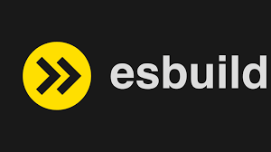

# vite におけるバンドル事情

## プロダクションではバンドルする理由

<https://ja.vitejs.dev/guide/why.html#%E3%83%95%E3%82%9A%E3%83%AD%E3%82%BF%E3%82%99%E3%82%AF%E3%82%B7%E3%83%A7%E3%83%B3%E3%81%A6%E3%82%99%E3%81%AF%E3%83%8F%E3%82%99%E3%83%B3%E3%83%88%E3%82%99%E3%83%AB%E3%81%99%E3%82%8B%E7%90%86%E7%94%B1>

ネイティブ ESM が広くサポートされるようになっても、バンドルされていない ESM をプロダクション用にリリースすることは非効率です(HTTP/2 を利用していても)。
**👉 ネットワークのラウンドトリップの増加がネストされたインポートによって引き起こされるため**

プロダクションでは最適化されたローディングパフォーマンスを得るために、
ツリー・シェイキングや遅延読み込み、(キャッシュ改善のための)共通コード分割などの技術を用いつつバンドルを行うことは、より良いことです。

開発サーバとプロダクションビルド間で、最適化された出力と一貫した動作を確保することは難しい。
↓
**Vite にはあらかじめ調整されたビルドコマンド（パフォーマンス最適化が施されている）が用意。**

## なぜ esbuild をバンドルツールとして使用しないのか？

> **Vite の現在のプラグイン API は、esbuild をバンドラツールとして使用することと互換性がない**。また、esbuild の方が速いにもかかわらず、**Vite は Rollup の柔軟なプラグイン API とインフラストラクチャを採用し、エコシステムでの成功に大きく貢献しました**。
> 当面は、Rollup の方がパフォーマンスと柔軟性のトレードオフに優れていると考えています。とはいえ、esbuild はこの数年で大きく進歩したので、将来的にプロダクションビルドに esbuild を使用する可能性を排除するつもりはありません。
> [公式の回答](https://vitejs.dev/guide/why.html#why-not-bundle-with-esbuild)

また別の理由としては、
**esbuild** はコード分割がまだ実現していない。[こんな場合](https://github.com/evanw/esbuild/issues/399)にアカンらしい。(https://esbuild.github.io/api/#splitting)

以下、[esbuild 公式のロードマップ](https://esbuild.github.io/faq/#upcoming-roadmap)。
既に完成形に近づいており、オールインワンツールにはしない強い意志(webpack のような負債を産まない)が感じられる。
それと同時に、コア自体のメンテナンスはしっかり行っていく方針だから、安心。

> 私は、esbuild がフロントエンドのすべてのニーズに対するオールインワンのソリューションになるべきだとは思わない。特に、"webpack config "モデルのような、根本的なツールが柔軟すぎてユーザビリティが損なわれるような苦痛や問題は避けたい。
> 例えば、esbuild のコア自体にこれらの機能を含めるつもりはない：
> 他のフロントエンド言語のサポート（Elm、Svelte、Vue、Angular など）
> TypeScript の型チェック（tsc を別途実行すればよい）
> カスタム AST 操作のための API
> ホットモジュールリロード
> モジュールのフェデレーション
> 私は、esbuild が安定に達した後も、esbuild の既存のスコープにあるすべてのものを保守し続けるつもりである。これは、例えば新しくリリースされた JavaScript や TypeScript の構文機能のサポートを実装することを意味する
