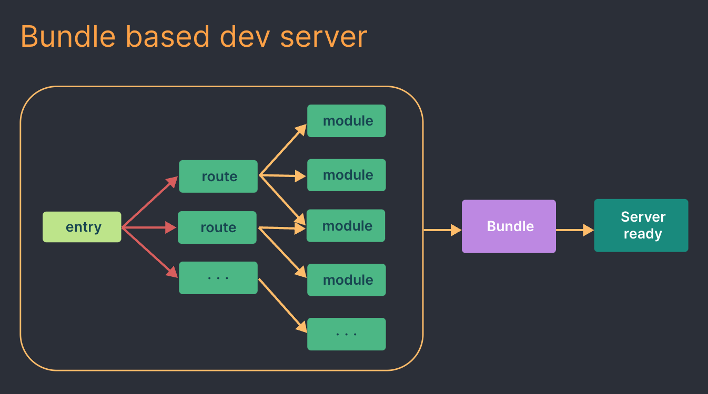

# Vite における開発サーバーが「速い」理由

## 従来のバンドラツールにおける開発サーバー

プロジェクト内の全てのファイル(依存関係の解決も含め)をコンパイルしバンドルしたソースコードを生成している。
👉 勿論、プロジェクトが肥大化するほど処理する時間も比例して長くなる。

## Vite (Native ESM ベース)における開発サーバー

Vite はアプリケーションのモジュールを「**依存関係**」と「**ソースコード**」の二種類に分解して処理をしている。

### 依存関係とは

node_modules フォルダからインポートした JavaScript モジュールのこと。
（この内の大部分は開発中あまり変更されないプレーンな JavaScript）

**Vite では、これらの依存関係（node_modules）を Go で書かれた JavaScript バンドラーであり、Webpack よりも 10-100 倍高速に動作する esbuild を使って事前バンドルを行っている。**

(ちなみに of ちなみに)
node_modules フォルダには何があるのか？
=> package.json ファイルの dependencies に記載されているパッケージ、及びそのパッケージ自体が依存するパッケージがすべてインストールされている。

### ソースコードとは

ソースコードには変換を必要とするプレーンな JavaScript ではないものが含まれることがよくあり、頻繁に編集されます(例: JSX、CSS や Vue/Svelte コンポーネント)。
また、全てのソースコードを同時に読み込む必要はありません(例: ルーティングによるコード分割)。

Vite は、ネイティブ ESM を行使してソースコードを提供します。ブラウザは、実質的にバンドラの仕事の一部を引き受けます: Vite はブラウザのリクエストに応じて、ソースコードを変換し提供するのみになります。条件で囲われている動的インポートのコードは、現在の画面で使われる場合のみ処理されます。

## モジュール更新の反映(HMR)が「速い」理由

WIP🔌
