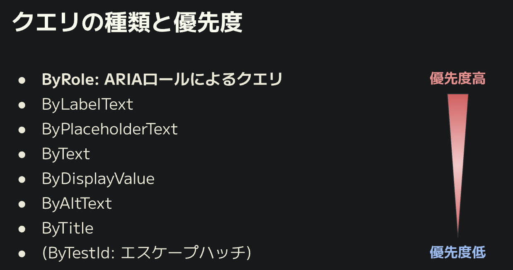
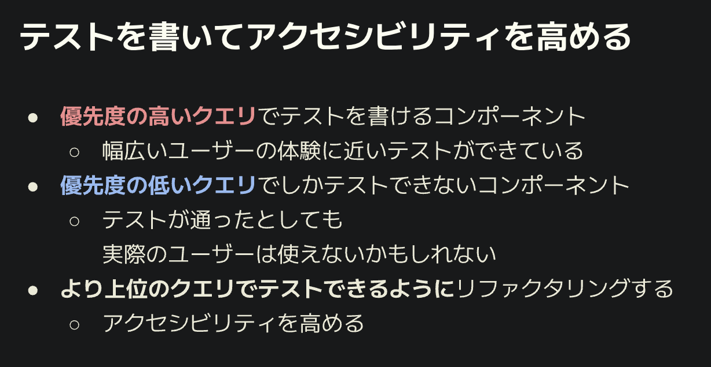
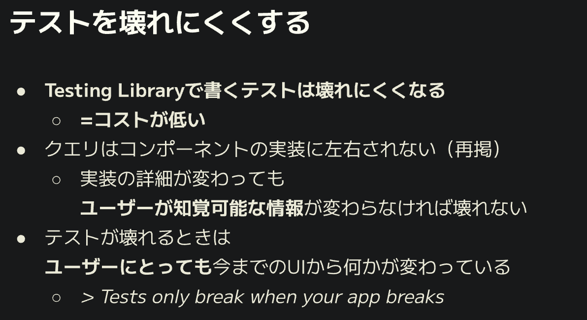

# 🧪フロントエンドにおけるUIのtest技法を学ぶ

## javascript-testing-best-practicesを読む

<https://zenn.dev/hrbrain/articles/18d4dbc2ac8e4f>

## 面倒かつ壊れやすいテストってどんなテスト？

- **テスト対象を知りすぎている**過保護なホワイトボックステスト（ゆえに壊れやすい。**UIで言うと、DOM要素が変わると崩壊するテスト。**）
- ガチガチな密結合でプロダクションコードを読み直さないと分からないもの
- 何をテストしていいのか分からないから、最初のローディング表示、ボタンのdisabled状態など目にしたものをテストに書いてしまうもの

<https://tech.quartetcom.co.jp/2023/07/13/angular-testing-library/#%E9%9D%A2%E5%80%92%E3%81%8F%E3%81%95%E3%81%84%E3%83%86%E3%82%B9%E3%83%88>

## そもそもテストを行う目的とは？

- テストがあることで何を得ることができるのか？　🤜 それは「安心」
- なんのためにテストを書くのか？　🤜 上と同義
- どのようなテストが良いテストなのか？　🤜 少ないテストで多くの安心が得られるもの

**このテストが通るなら本番でも問題ないという「安心」を得るのが目的 👀**
**（= 「本番でユーザーに使ってもらう」の再現度が大事！！！！！）**
👉 少ないテストで上の安心感が得られるのがもっとも理想的！

## UIのテストのパフォーマンスを高めるには？

<ユーザーにできないこと>

- id属性で要素を見つける
- class属性で要素を見つける
- タグの親子関係を把握する

<ユーザーに可能なこと>

- テキストを読む
- フォームに入力する
- ボタンをクリックする

**結論:ユーザーに可能なことだけテストをすること**
**👉 「ユーザーが視覚可能な情報」と「ユーザーが実行可能なアクション」の組み合わせでテストを作る**

## Testing Libraryの設計原則

1。コンポーネントのレンダリングにおけるテストは、コンポーネントインスタンスではなくDOMノードを扱うべき。
2**ユーザーが使用する方法**で、アプリケーションコンポーネントをテストするのに便利であるべき
3ユーティリティの実装やAPIは、**シンプルで柔軟**であるべき

<https://testing-library.com/docs/guiding-principles/>

## Testing Libraryにおけるコンポーネントテスト

```tsx
import SomeComponent from "./some-component";
import { render } from "@testing-library/xxx";

test("送信ボタンを表示する", async () => {
    // 1
    const { getByRole } = render(SomeComponent);
    // 2
    const button = getByRole("button", {name: "送信"});
    // 3
    except(button).toBeTruthy();
})
```

1　render関数におけるDOM生成
-> コンポーネントを引数にとりDOMを生成する関数

**2　テスト対象の要素をクエリする（Testing Libraryのもっともコアな部分）**
-> クエリを用いて特定のDOM要素を取り出す。なるべく、**ユーザーのように**要素を見つける！

3　クエリ結果（DOM要素）を検証する

POINT : **「何を手がかりに要素を見つけるか？」＝アクセシブルな情報**







<https://blog.lacolaco.net/2023/06/presentation-phpconfuk-testing-dom/>